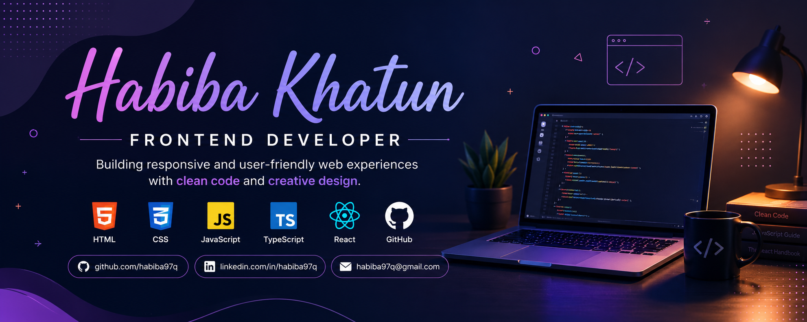

<!-- ======================= Banner ======================= -->

  

 

<!-- ======================= Title ======================= -->

# Hi 👋, I'm Asma Khatun

### Aspiring Frontend Developer | JavaScript & TypeScript Learner

 

<!-- ======================= About Me ======================= -->

## 👩‍💻 About Me

I'm a Computer Science student and an aspiring Frontend Developer
passionate about learning modern web technologies and building
responsive, user-friendly web applications.

I enjoy turning ideas into clean and interactive websites while
continuously improving my programming and problem-solving skills.

### 🚀 Currently

- 🌱 Learning JavaScript and TypeScript
- ⚛️ Exploring React.js
- 💻 Building responsive web projects
- 🎨 Improving my frontend development skills
- 📚 Practicing problem solving and programming
- 🔍 Exploring modern web development technologies

 

<!-- ======================= Socials ======================= -->

## 🌐 Connect With Me

<!-- Add your LinkedIn link here -->

 

<!-- ======================= Technology Stack ======================= -->

## 🛠️ Technology Stack

### Languages

### Frameworks & Libraries

### Tools & Technologies

 

<!-- ======================= GitHub Statistics ======================= -->

## 📊 GitHub Statistics

 

<!-- ======================= Streak ======================= -->

## 🔥 GitHub Streak

 

<!-- ======================= Contribution ======================= -->

## 🐍 Contribution Activity

 

<!-- ======================= Profile Views ======================= -->

## 👀 Profile Views

 

<!-- ======================= Quote ======================= -->

## 💬 Random Developer Quote

---

### ✨ Thanks for visiting my profile!

